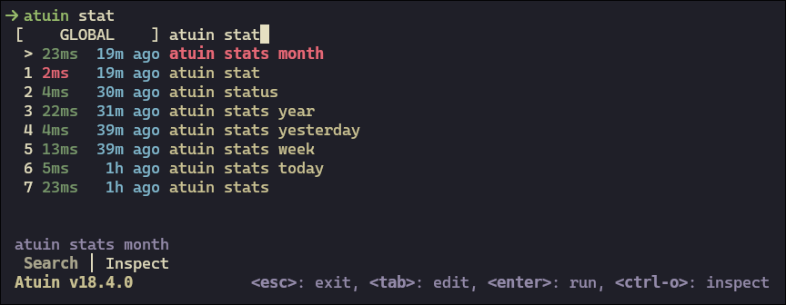

# Kanagawa Atuin Theme

A simple colorscheme for Atuin.



## Install

- Copy kanagawa.toml in your `~/.config/atuin/themes` (or in `$ATUIN_THEME_DIR`
  if set).

- Add these lines to `~/.config/atuin/config.toml`

  ```toml
  [theme]
  name = "kanagawa"
  ```

## Resources

- [Atuin theming guide](https://docs.atuin.sh/guide/theming/)
- [Atuin theming source](https://github.com/atuinsh/atuin/blob/main/crates/atuin-client/src/theme.rs)

## Credits

Inspired and based on the color palette of
[kanagawa.nvim](https://github.com/rebelot/kanagawa.nvim?tab=readme-ov-file#color-palette)
